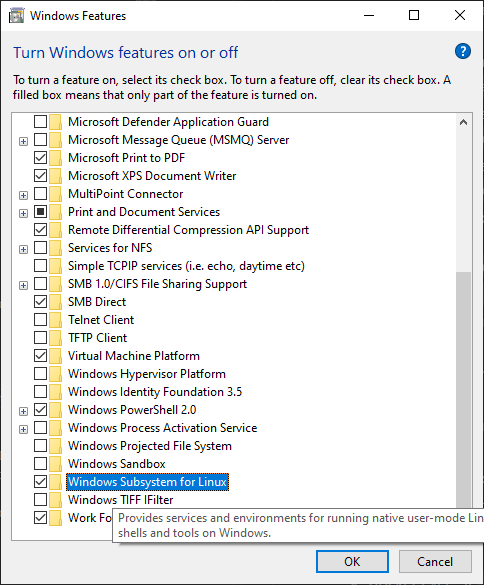

# Docker commands and overview <!-- omit in toc -->
## Contents <!-- omit in toc -->

- [1. Instalation in Windows 10](#1-instalation-in-windows-10)
- [2. Docker commands](#2-docker-commands)
- [3. Dockerfile structure](#3-dockerfile-structure)
- [4. Docker compose](#4-docker-compose)
  - [4.1. Commands Docker Compose](#41-commands-docker-compose)
  - [4.2. Docker Compose template](#42-docker-compose-template)
- [5. Access Docker using REST API or Expose docker remotely](#5-access-docker-using-rest-api-or-expose-docker-remotely)
- [6. Docker images](#6-docker-images)
  - [6.1. RabbitMQ image (http://localhost:15672/)](#61-rabbitmq-image-httplocalhost15672)
  - [6.2. MsSql image (localhost,1445)](#62-mssql-image-localhost1445)
  - [6.3. Jenkins image](#63-jenkins-image)
  - [6.4. Gitlab image](#64-gitlab-image)
- [7. Extras](#7-extras)

## 1. Instalation in Windows 10
- Enable WSL in Windows 10
  - 
- Update wsl to wsl2
  - wsl --update

## 2. Docker commands
- All informations about docker in the machine
  - docker info
- Show the Docker version information
  - docker --version
- Create container by image
  - docker create --name `<container_name>` `<image_name>`
- Show running containers (Process status)
  - docker ps
  - docker ps -a # Show all
  - docker container ls -a
  - docker container ps -a
- List all images in local repository
  - docker images
- Pull (download) an image or a repository from a registry
  - docker pull `<image_name>:<version>` or `<tag>` # Example docker pull hello-world:latest
- Rum a command to start a container
  - docker start `<container_name>`
- Rum a command to stop a container
  - docker stop `<container_name>`
- Create and run the container, this command eliminates the need to run `docker create` and then `docker start`
  - docker run `<image_name>` # Example docker run hello-world
  - docker run -d `<image_name>` # Run container in background and print container ID 
  - docker run -it --rm `<image_name>` # Run and delete the container when the container stops
- Remove image
  - docker image rm `<image_name>` or `<image_id>` # Example docker image rm hello-world:latest
- Remove container
  - docker container rm `<container_name>` or `<container_id>`
- Docker attach commands to start the container and peek at the output stream
  - docker attach --sig-proxy=false core-counter `<container_name>`
- Fetch the logs of a container
  - docker logs -f `<image_name>` # Log live
- Run a command in a running container
  - docker exec -it `<container_name>` bash # -ti --interactive and --tty
  - docker exec -it -u root `<container_name>` bash # With user root
- Copy files/folders between a container and the local filesystem
  - docker cp `<file_name>` `<container_name>`:`<path>`/`<file_name>` # Example: docker cp script.sh myContainer:/tmp/script.sh
- Build Dockerfile
  - docker build .

## 3. Dockerfile structure
- `FROM` # Fully qualified Docker container image name
- `COPY` # Copy the specified folder on your computer to a folder in the container
- `WORKDIR` # Changes the current directory inside of the container to App
- `ENTRYPOINT` # Tells Docker to configure the container to run as an executable

## 4. Docker compose
### 4.1. Commands Docker Compose
- All informations about docker compose in the machine
  - docker-compose version
- Create/Recreate and start containers, use docker-compose.yml
  - docker-compose up -d
- Build or rebuild services
  - docker-compose build
- Starts existing containers for a service.
  - docker-compose start
- Stop all containers
  - docker-compose stop
- Docker 
  - compose-build
- Remove all containers and images
  ```
  docker-compose down
  docker rm -f $(docker ps -a -q)
  docker volume rm $(docker volume ls -q)
  docker rmi -f $(docker images -a -q)
  ```

### 4.2. Docker Compose template
```
version: '3'
services:
  my_service:
    container_name: CONTAINER_NAME
    image: IMAGE_NAME
    ports:
      - "8080:8080"
    volumes:
      - "$PWD/HOME:/VAR/PATH_HERE"
    networks:
      - net
networks:
  net: 
```

## 5. Access Docker using REST API or Expose docker remotely
1. ps -ef | grep docker
2. sudo nano /lib/systemd/system/docker.service
3. Replace line ExecStart=*** to ExecStart=/usr/bin/dockerd -H fd:// -H=tcp://0.0.0.0:2375
4. sudo systemctl daemon-reload
5. sudo service docker restart
6. Test with url http://address:2375/images/json or http://address:2375/containers/json

## 6. Docker images
### 6.1. RabbitMQ image (http://localhost:15672/)
- docker pull rabbitmq:3-management
- docker run -d -p 15672:15672 -p 5672:5672 --name rabbit_dev rabbitmq:3-management
- docker run -d -p 5672:5672 -p 15672:15672 --name rabbitmq_dev rabbitmq:3.9-management
- Default user and password: guest/guest

### 6.2. MsSql image (localhost,1445)
- docker pull mcr.microsoft.com/mssql/server:2019-latest
- docker run -d -e "ACCEPT_EULA=Y" -e "SA_PASSWORD=yourStrong(!)Password" --name ordermssql -p 1445:1433 mcr.microsoft.com/mssql/server:2019-latest

### 6.3. Jenkins image
- docker pull jenkins/jenkins
- docker run -p 8080:8080 jenkins/jenkins -- name jenkins_dev

### 6.4. Gitlab image
- sudo docker exec -it gitlab_dev grep 'Password:' /etc/gitlab/initial_root_password
- sudo gitlab-rake "gitlab:password:reset[root]"

## 7. Extras
- Specific command to dotnet applications
  - docker build -f API\Dockerfile . -t api